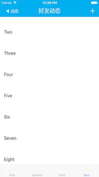

# ZZNaviBar_tableHeader

**导航条透明、tableView头部视图缩放**  
访照其他第三方总结

效果图：





**使用方法**  
导航条：

```
#import "UINavigationBar+ZZHelper"
[self.navigationController.navigationBar zz_setBackgroundColor:[UIColor clearColor]];
- (void)scrollViewDidScroll:(UIScrollView *)scrollView {
    UIColor *color        = [UIColor colorWithRed:0 green:175/255.0 blue:240/255.0 alpha:1];    
    CGFloat offsetY       = scrollView.contentOffset.y - self.tableView.frame.origin.y;
    CGFloat criticalPoint = kTableHeaderHeight - kNaviBarHeight; // 临界点
    if (offsetY > criticalPoint) {
        [self.navigationController.navigationBar zz_setBackgroundColor:color];
    } else {
        [self.navigationController.navigationBar zz_setBackgroundColor:[color colorWithAlphaComponent:0]];
    }
}
```

table view 头视图：  

```
#import "UITableView+ZZStretchableHeader.h"
self.tableView.headerViewStretchable = YES;
```
